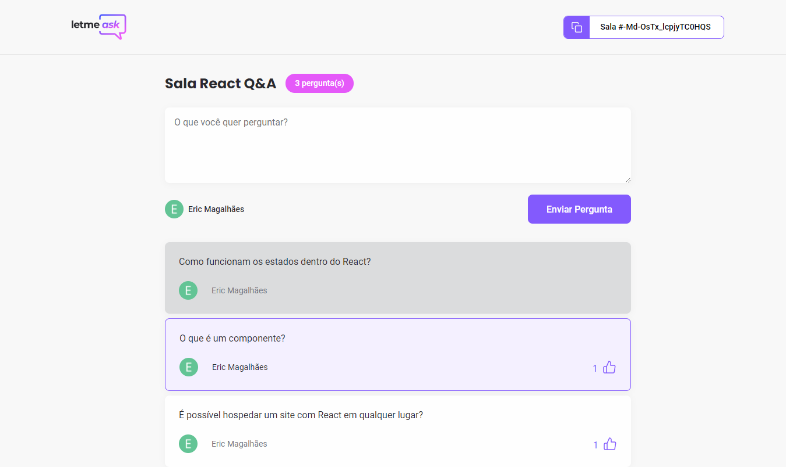
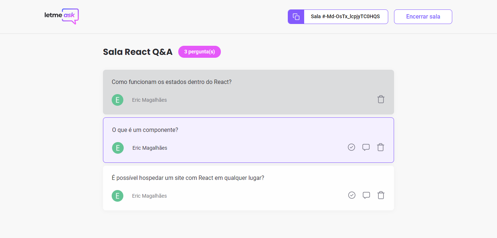

<p align="center">
  
</p>


<p align="center">
  <a href="#about">About</a>&nbsp;&nbsp;&nbsp;|&nbsp;&nbsp;&nbsp;
  <a href="#preview">Preview</a>&nbsp;&nbsp;&nbsp;|&nbsp;&nbsp;&nbsp;
  <a href="#technologies">Technologies</a>&nbsp;&nbsp;&nbsp;|&nbsp;&nbsp;&nbsp;
  <a href="#building">Building</a>&nbsp;&nbsp;&nbsp;|&nbsp;&nbsp;&nbsp;
  <a href="#contributing">Contributing</a>&nbsp;&nbsp;&nbsp;
</p>

## About
<strong>Letmeask</strong> it is a place where your audience can gather to send their main questions, and your host will answer them.

## Preview
<p align="center">
  
  
  
  
</p>


## Technologies
This project was developed using the following technologies:

- [React](https://reactjs.org/)
- [TypeScript](https://www.typescriptlang.org/)
- [Firebase](https://firebase.google.com/)


## Building
#### Front-end
You'll need [Node.js](https://nodejs.org) installed on your computer in order to build this app.

```bash
$ git clone https://github.com/eric-souzams/letmeask.git
$ cd letmeask
$ npm install
$ npm start
```

#### Baas - Back-end as a service
On firebase you will need: 
- Create a project
- Enable authentication with Google
- Create a realtime database
- Set rules
- Add new app -> Web
- Set environment variables on project source 

<br/>

```json
Realtime Database Rules

{
  "rules": {
    "rooms": {
      ".read": false,
      ".write": "auth != null",
      "$roomId": {
        ".read": true,
        ".write": "auth != null && (!data.exists() || data.child('authorId').val() == auth.id)",
        "questions": {
          ".read": true,
          ".write": "auth != null && (!data.exists() || data.parent().child('authorId').val() == auth.id)",
          "likes": {
            ".read": true,
            ".write": "auth != null && (!data.exists() || data.child('authorId').val() == auth.id)",  
          }
        }
      }
    }
  }
}
```


## Contributing
This repository is currently under development. If you want to contribute please fork the repository and get your hands dirty, and make the changes as you'd like and submit the Pull request.